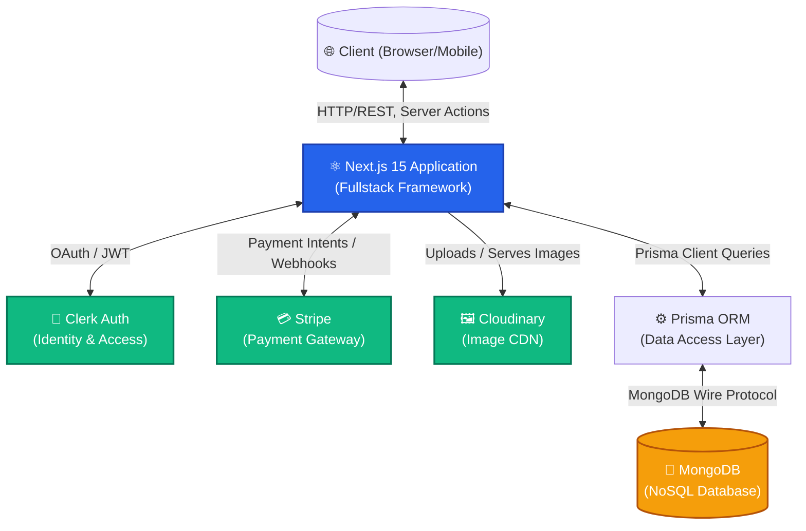
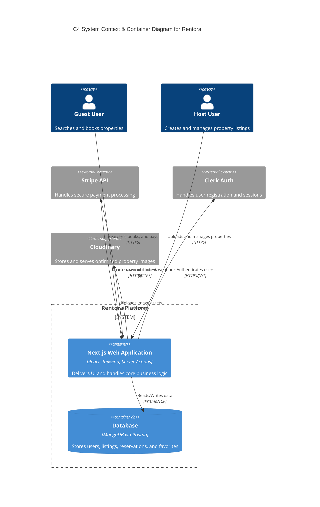
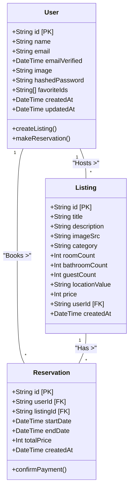
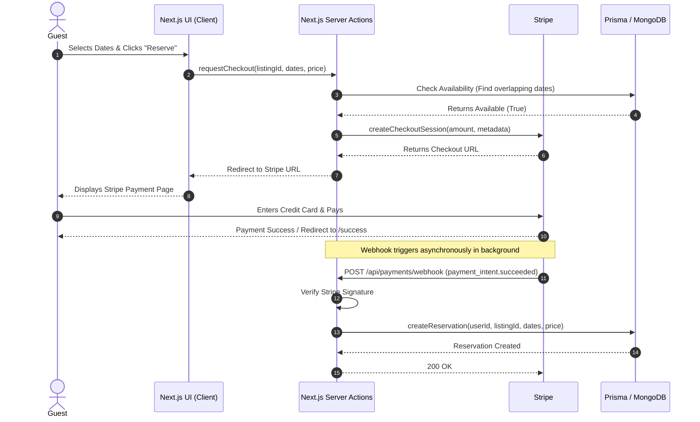

# Rentora (WorldBnb) - Technical & Architectural Deep Dive

This document is a comprehensive "under the hood" look at Rentora. It's written conversationally to walk you through exactly what we built, why we built it that way, and how all the moving parts fit together. You can use this as the raw "meat" to flesh out the detailed sections of your academic thesis.

---

## 1. The App Walkthrough: Every Screen & Page

If we were sitting next to each other, here is how I would walk you through the Rentora platform step-by-step. 

### Public / Static Pages
*   **The Landing Page (`/`)**: This is the "WOW" moment. We built a dynamic, highly visual hero section where users can search for destinations, dates, and guests. It features smooth scrolling, statistics, "Top Destinations" cards, and guest testimonials. It's designed to instantly build trust and excite the user.
*   **Static Pages (`/privacy`, `/terms`, `/support`, `/rentora`)**: Essential informational pages explaining our policies, how the platform works, and how to get help. 

### Authentication Flow
*   **Sign-In (`/sign-in`) & Sign-Up (`/sign-up`)**: We offloaded the heavy lifting of security to Clerk. These pages provide a beautiful, seamless login experience (supporting social logins and standard email/password) while ensuring enterprise-grade security. 

### The Core Guest Experience (Dashboard Area)
*   **Dashboard Home (`/dashboard`)**: The central hub once a user logs in. It gives a quick overview of their upcoming trips, recent notifications, and suggested properties based on their profile.
*   **Search & Discover (`/listings`)**: The heart of the app. Users can browse thousands of properties. This page dynamically pulls data from our database using Next.js Server Actions, allowing for lightning-fast filtering by category (e.g., Beach, Mountain, City), price, and location.
*   **Property Details (Modal / Page)**: When a user clicks a property, they see the high-res images, detailed descriptions, amenities, host information, and a date-picker to select their stay. 
*   **Wishlist (`/wishlist`)**: Users can "heart" properties they love. This screen simply queries the database for listings whose IDs match the user's `favoriteIds` array.
*   **My Trips / Bookings (`/bookings`)**: A list of all upcoming and past reservations the user has made, showing dates, total price, and property details.
*   **Booking Success (`/bookings/success`)**: The confirmation screen users see immediately after a successful Stripe payment. 

### The Host Experience
*   **Create Listing (`/create-listing`)**: A multi-step form where hosts can upload their property. They set the title, description, location (using maps), room counts, and price. Images are uploaded directly to Cloudinary for optimized delivery.
*   **My Properties (`/my-properties`)**: A specialized dashboard for hosts to see the properties they have listed on the platform. From here, they can manage their listings or delete them.

### Global Components
*   **Profile (`/profile`)**: User settings, avatar updates, and personal information management.
*   **Notifications (`/notifications`)**: A centralized feed for alerts (e.g., "Your booking is confirmed!", "You have a new reservation!").

---

## 2. What Was Genuinely Difficult & Interesting to Build?

Writing standard CRUD (Create, Read, Update, Delete) apps is easy. Rentora is complex because it mimics a real-world, highly transactional marketplace. Here is what was technically challenging:

### A. The Next.js 15 App Router & Server Actions
Instead of building a traditional, separate REST API (like an Express.js backend), we leveraged Next.js **Server Actions** (e.g., `getListings.ts`, `createListing.ts`). 
*   **The Challenge**: Shifting the mental model from "Client requests API -> API queries DB" to "Client calls a server function directly." 
*   **The Cool Part**: This drastically reduced our boilerplate code. Data fetching happens directly on the server, making the app incredibly fast and improving SEO because pages can be Server-Side Rendered (SSR) or statically generated.

### B. The Financial Engine (Stripe Integration)
Handling other people's money is always the most stressful part of software engineering.
*   **The Challenge**: We had to ensure a user couldn't book a property unless they actually paid, and two users couldn't book the exact same dates simultaneously (Race Conditions). 
*   **The Implementation**: We built a checkout flow in `/api/payments/create-checkout`. When a user clicks "Book", we generate a Stripe Checkout session. We don't save the reservation immediately. Instead, we wait for Stripe's servers to call our `/api/payments/webhook` endpoint confirming the payment was successful. Only then does our server lock in the reservation in the database.

### C. Relational Data in a NoSQL Database
We are using MongoDB (a NoSQL document database), but we are using Prisma (an ORM usually used for SQL relational databases) to interact with it.
*   **The Challenge**: Mapping relations (like "A User has many Listings" and "A Reservation belongs to both a User and a Listing") in MongoDB requires careful schema design using `ObjectIds`.
*   **The Cool Part**: Prisma allowed us to enforce strict TypeScript types across our entire application while keeping the flexibility and scalability of MongoDB. 

---

## 3. The Database Look & Feel (Main Models)

Our database is lean and highly normalized to prevent data duplication. Here are the core entities from our `schema.prisma`:

1.  **User Model**: The center of the ecosystem.
    *   Holds authentication details (`email`, `hashedPassword`), profile info (`name`, `image`).
    *   Contains a clever `favoriteIds` array (storing references to favorite properties directly on the user object for fast Wishlist loading).
    *   *Relations*: A User can be a Host (has many `Listings`) or a Guest (has many `Reservations`).
2.  **Listing Model**: The properties available for rent.
    *   Holds physical traits (`roomCount`, `bathroomCount`, `guestCount`, `locationValue`).
    *   Holds UI details (`title`, `description`, `imageSrc`, `category`, `price`).
    *   *Relations*: Belongs to one Host (`userId`), and can have many `Reservations`.
3.  **Reservation Model**: The transactional glue.
    *   Holds the exact booking window (`startDate`, `endDate`) and the financial agreement (`totalPrice`).
    *   *Relations*: Links one Guest (`userId`) to one Property (`listingId`).

---

## 4. Architectural Diagrams (For Your Thesis)

Below are the diagrams you can directly drop into your thesis. They are written in Mermaid.js syntax, which renders beautiful diagrams automatically in GitHub, Notion, or Markdown editors.

### A. High-Level System Architecture
*Provides a zoomed-out view showing how major services connect.*

### B. C4 Model (Context & Container Level)
*Shows how the user interacts with the system containers.*

### C. UML Class Diagram (Database Schema)
*Charts the structural relationships of our data entities.*

### D. UML Sequence Diagram (The Booking Flow)
*Charts the exact runtime interactions when a user books a home and pays via Stripe.*

---

### How to use this for your Thesis:
1. **Methodology & Architecture**: Use the High-Level System Architecture and C4 Model to explain *how* the system is built. Talk about the separation of concerns (using external APIs for Auth, Payments, and Media so the core app remains lightweight).
2. **Implementation & Challenges**: Use the "What was genuinely difficult" section to prove you understand the underlying computer science concepts (Concurrency/Race conditions with payments, SSR vs CSR, Relational vs NoSQL).
3. **Data Design**: Use the UML Class Diagram and the Database section to explain your data normalization strategy.
4. **System Behavior**: Use the UML Sequence Diagram to explain the asynchronous nature of webhooks and secure payment processing.
