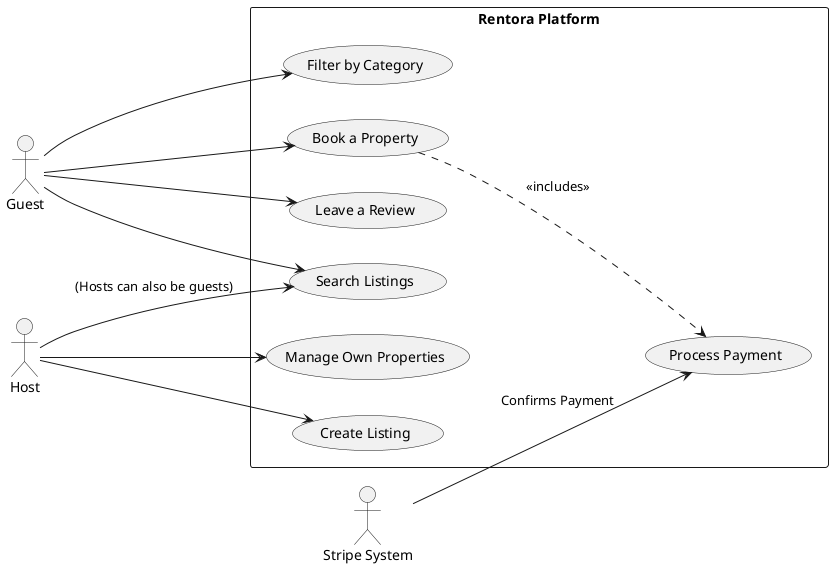
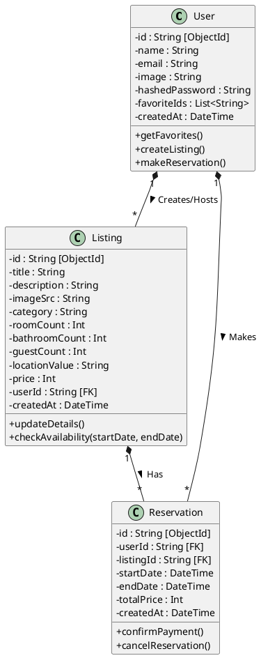
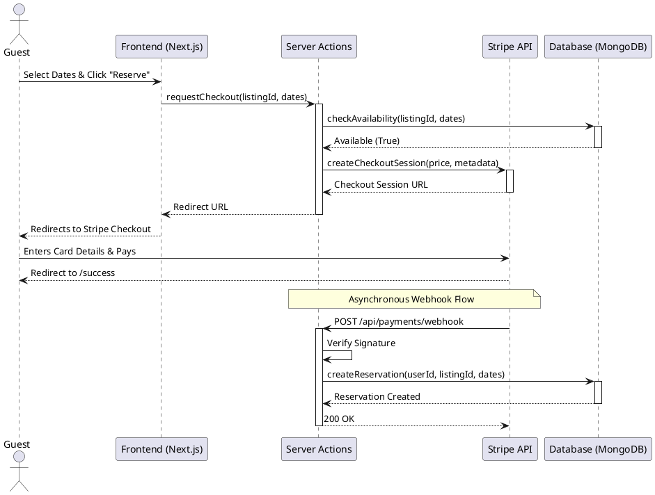
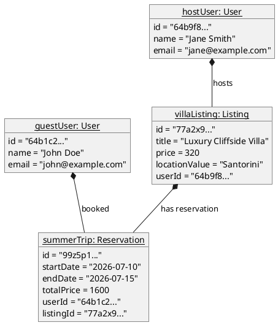
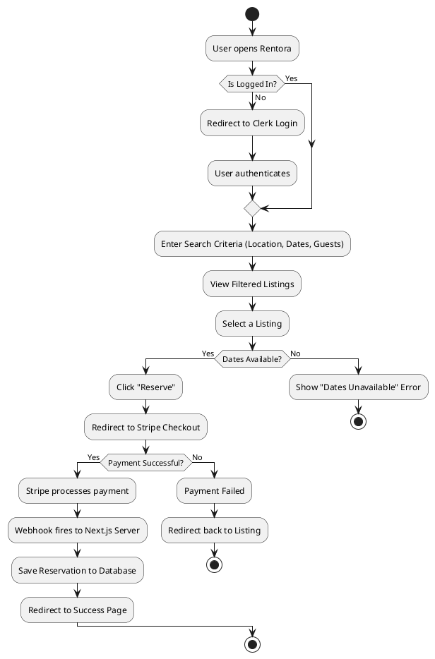
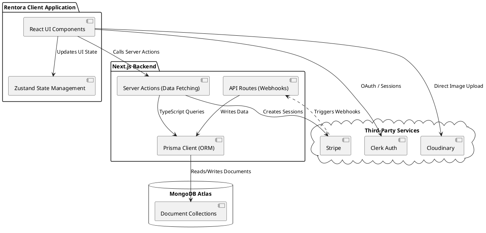
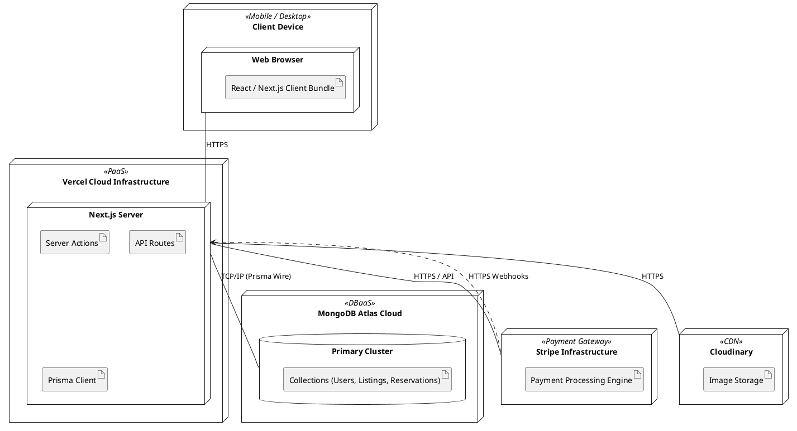
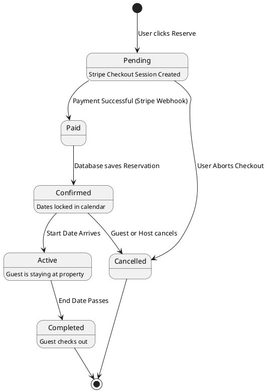
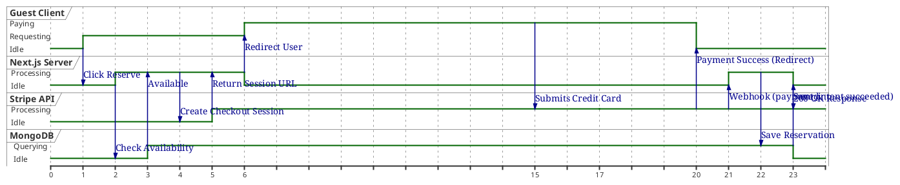

# Rentora (WorldBnb) - Architecture & UML Diagrams

## How to Visualize These Diagrams

### 1. How to Visualize the Previous "Mermaid" Diagrams
The diagrams in the previous document were written in **Mermaid.js**.
*   **Native Support**: If you copy and paste the Markdown block (with ` ```mermaid `) into GitHub, Notion, or Obsidian, it will automatically render the diagram.
*   **Online Editor**: You can copy the code and paste it into the [Mermaid Live Editor](https://mermaid.live/) to view it and export it as a PNG or SVG.

### 2. How to Visualize "PlantUML" Diagrams
The diagrams below are written in **PlantUML**, which is an industry standard for academic and enterprise UML modeling.
*   **VS Code**: Install the **"PlantUML"** extension by *jebbs*. You can then press `Alt + D` (or `Option + D` on Mac) inside a `.puml` or `.md` file to preview the diagram right in your editor.
*   **Online Web Server**: Copy everything between `@startuml` and `@enduml` and paste it into [PlantText](https://www.planttext.com/) or the [Official PlantUML Server](https://www.plantuml.com/plantuml/uml/). It will generate an image you can download for your thesis.

---

Below is the PlantUML code for every diagram type you requested, custom-tailored for the Rentora architecture.

### 1. Use Case Diagram
This Use Case diagram outlines the primary interactions between the different actors (Guests, Hosts, and the external Stripe System) and the Rentora platform. It visualizes the core functional requirements of the application, demonstrating how Guests can search, filter, book, and review properties, while Hosts can create and manage their own listings. It also highlights the dependency of the booking process on the Stripe system for secure payment confirmation.



### 2. Class Diagram
This Class diagram represents the underlying domain model and database schema for Rentora, detailing the exact attributes and data types (such as MongoDB ObjectIds) for the User, Listing, and Reservation entities. It illustrates the cardinal relationships between these models, specifically showing how a single User can create multiple Listings (as a Host) or make multiple Reservations (as a Guest), and how a Listing can have multiple Reservations over time.



### 3. Sequence Diagram
This Sequence diagram charts the chronological execution flow when a user decides to book a property on Rentora. It breaks down the process step-by-step across the Frontend UI, the Next.js Server Actions, the MongoDB database, and the external Stripe API. Most importantly, it visualizes the critical asynchronous webhook mechanism where the Next.js server waits for Stripe's secure background confirmation before permanently locking the reservation into the database.



### 4. Object Diagram
This Object diagram captures a specific, concrete snapshot of the Rentora system at runtime, moving from abstract classes to real instances of data. It shows a scenario where a specific guest user ("John Doe") has successfully booked a specific listing ("Luxury Cliffside Villa") owned by a specific host ("Jane Smith") for a defined set of summer dates, explicitly mapping out the real-world IDs, prices, and relationships holding the system together in that moment.



### 5. Activity Diagram
This Activity diagram maps out the dynamic workflow and decision-making paths a user navigates when attempting to book a property. From the initial entry point, it traces the conditional logic of authentication, searching, and date availability checks. It details the branching paths that occur during the checkout phase, showing how the system handles both successful payment flows (resulting in a saved database reservation) and failed payments (where the user is redirected back).



### 6. Component Diagram
This Component diagram provides a high-level structural view of the Rentora software architecture, dividing the application into its logical packages: the Client Application, the Next.js Backend, the Database, and Third-Party Services. It visually demonstrates the wiring and communication boundaries, such as how the React UI relies on Server Actions for data fetching, how the API Routes utilize the Prisma ORM to interact with MongoDB, and where external dependencies like Clerk, Stripe, and Cloudinary plug into the ecosystem.



### 7. Deployment Diagram
This Deployment diagram illustrates the physical cloud infrastructure and execution environments required to host the Rentora application in production. It maps the software artifacts to their respective nodes, showing the React bundle running on the end-user's device, the Next.js server operating on Vercel's Platform-as-a-Service, the MongoDB collections residing in an Atlas cluster, and the secure HTTPS connections linking the backend to external infrastructure like Stripe and Cloudinary.



### 8. State Diagram
This State diagram models the lifecycle and transition states of a single Reservation entity from its inception to its conclusion. It tracks the status changes triggered by specific events—beginning as a "Pending" checkout session, moving to "Paid" via Stripe webhooks, locking as "Confirmed" in the database, becoming "Active" on the start date, and finally reaching "Completed" or "Cancelled" states, helping developers understand all possible statuses a booking can exist in.



### 9. Timing Diagram
This Timing diagram provides a time-centric visualization of the booking and payment lifecycle, specifically designed to highlight the latency and asynchronous nature of external API calls. By tracking the state changes across the Client, Server, Database, and Stripe over an arbitrary timeline, it clearly communicates why the UI must handle loading states during payment processing and demonstrates the delayed background execution of the Stripe webhook that finalizes the reservation.


